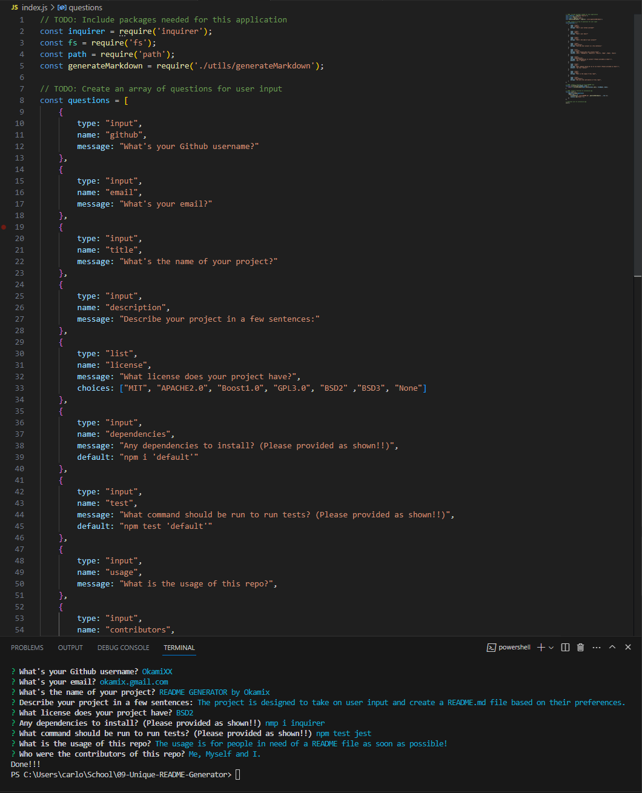
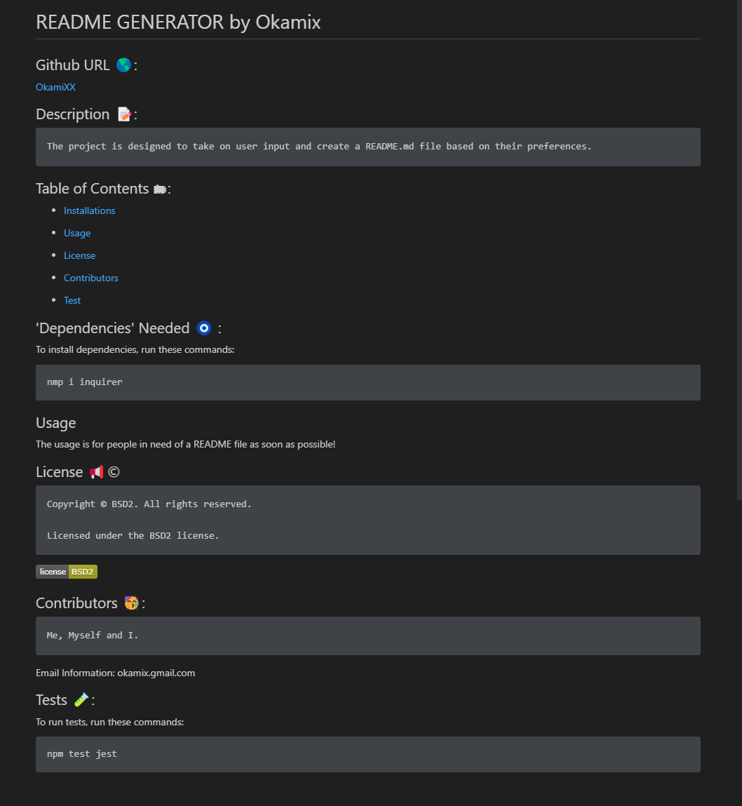

# Professional README Generator.

## Purpose/ How to use:
* Main purpose is to create a porfessional README.md file based on what the user inputs.
* Information asked will be: 
    1. GitHub username
    2. Email
    3. Project name
    4. Project's description
    5. License
    6. Dependencies/Packages
    7. Test package to use.
    8. Contributors.
* After all the information its inputed the README file will be generated succesfully.

## USER STORY : 
```
AS A developer
I WANT a README generator
SO THAT I can quickly create a professional README for a new project
```
## Acceptance Criteria : 
```
GIVEN a command-line application that accepts user input
WHEN I am prompted for information about my application repository
THEN a high-quality, professional README.md is generated with the title of my project and sections entitled Description, Table of Contents, Installation, Usage, License, Contributing, Tests, and Questions
WHEN I enter my project title
THEN this is displayed as the title of the README
WHEN I enter a description, installation instructions, usage information, contribution guidelines, and test instructions
THEN this information is added to the sections of the README entitled Description, Installation, Usage, Contributing, and Tests
WHEN I choose a license for my application from a list of options
THEN a badge for that license is added near the top of the README and a notice is added to the section of the README entitled License that explains which license the application is covered under
WHEN I enter my GitHub username
THEN this is added to the section of the README entitled Questions, with a link to my GitHub profile
WHEN I enter my email address
THEN this is added to the section of the README entitled Questions, with instructions on how to reach me with additional questions
WHEN I click on the links in the Table of Contents
THEN I am taken to the corresponding section of the README
```
## SCREENSHOTS:
#### What whas inputed:


#### What was generated:


## GitHub Repo Link:
[https://github.com/OkamiXX/09-Unique-README-Generator](https://github.com/OkamiXX/09-Unique-README-Generator)

## Walkthrough Video:

[https://drive.google.com/file/d/1YylQsFou-nuR10-jDo6wExl-mT4LUDUa/view](https://drive.google.com/file/d/1YylQsFou-nuR10-jDo6wExl-mT4LUDUa/view)